# Diplomachain User Manual

## Created for the diplomachain beta version - Jan 2021   

## Table of Contents
- [Introduction](#intro)
- [Glossary](#glossary)
- [Aim & Audience](#aim)
- [Admin Role](#admin)
    - Create digital diploma blueprint
    - Issue digital diploma
    - Accept digital diploma
- [Student Role](#student)
    - Request a digital diploma
    - Download a digital diploma in file format
- [Verifier Role](#verifier)
    - Verify a digital diploma
- [Conclusion](#end)

## Introduction 

### This document represents a detailed guide for diplomachain users. As a platform for issuing & requesting digital diplomas, there are three main roles. Each role has a set of features and for each feature we'll detail the steps needed to use it. 

### All provided details in this document refer to the features existing in the beta verison of the diplomachain platform, future changes may introduce updated user manuals illustrating the new features or the problems' fixes.

### For an easier navigation through the document, please refer to the table of contents.

## Glossary 

* **Ethereum** : A public blockchain network, with support for smart contracts.

* **Smart Contract** : A digital contract implemented by a specialized programming language and executed in the blockchain network nodes.

* **Transaction** : The transfer of a value from one entity to another. In the Ethereum context, it refers to the blockchain transaction.

* **Digital diploma** : A certificate with a digital format, issued by the corresponding authority and verifiable by third parties. 

* **Issuing** : Providing a student/holder with a signed digital diploma.

* **Diploma blueprint** : In diplomachain, a blueprint is a diploma's type which contains a set of values for the diploma's attributes. It serves as a reference when issuing diplomas.

* **Diploma Request** : The process of demanding to obtain a diploma from the platform's admin.

* **Diploma verification** : The process of verifying the digital diploma by interacting with the blockchain network, checking that the diploma exists by verifying that the provided values match the stored ones. 

## Aim & Audience 

The aim of this user manual is to facilitate the usage of the diplomachain platform. It is designed to explain detailed and simple steps dedicated to both new and experienced technology users to use each feature within the platform. It contains a good number of screenshots and visual elements for maximum clarity.  

This user manual contains the explanation and steps required to use the features per role:

* Admin:   
    The Diplomachain admin is the supervisor of the platform activities, the only legit user with diploma issue privileges, an admin can:
    * Issue a digital diploma 
    * Examine digital diploma requests
    * Create a digital diploma blueprint
* Student:    
    In Diplomachain, the student represents the diploma holder. A student is able to:
    - Request a digital diploma
    - Download a digital diploma in a file format
* Verifier:    
    The verifier role represents any tier interacting with the platform to verify a received digital diploma.
    

## Admin Role 

The admin for the diplomachain platform, will use the web application to create the diploma blueprint for each separate diploma type, issue diploma for students/holders in bulk, validate diploma requests after a verification phase with the institute's administration. 

### Create a digital diploma blueprint

To be able to issue a diploma, it is required for the admin to create the diploma blueprints. This phase is divided into these following steps:

#### 1. Navigate to the admin's dashboard

Select the right part of the admin's dashboard by referring to the component's header:

Use the add button to pop-up the blueprint form:

#### 2. Fill the blueprint's creation form

The blueprint's creation form requires three inputs: the diploma title, the diploma description and the diploma specialty. Also it includes a visual representation of the diploma that will change accordingly to the provided inputs.
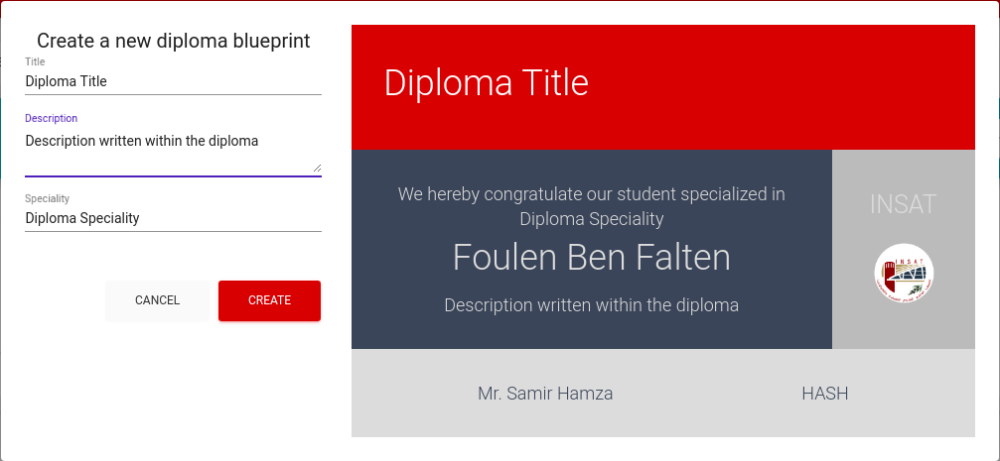

After filling the form, the admin initiates its creation by clicking on:

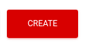

#### 3. Validate transaction

After filling the blueprint diploma form and clicking on the create button, a metamask window will pop up and the admin is required to confirm the Ethereum transaction.

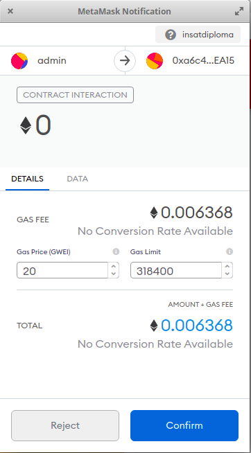

After confirming the transaction, the diploma blueprint will be added to the blockchain storage and it will show up within the blueprints list.

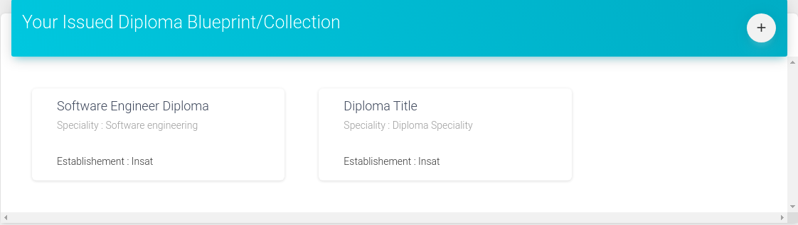

The newly created blueprint can now be used when issuing a digital diploma by the admin or when requesting a digital diploma by the student.

### Issue digital diploma

Diplomachain's main feature is issuing digital diplomas. For this reason, the diplomachain developer aimed to simplify the process in the aim of mitigating human errors.

#### 1. Navigate to the issuing dashboard

Within the admin dashboard, the admin can use this button to navigate to the issuing page:

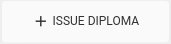

The issuing page contains a list of diploma drafts, that will be used when issuing the diplomas by the admin.

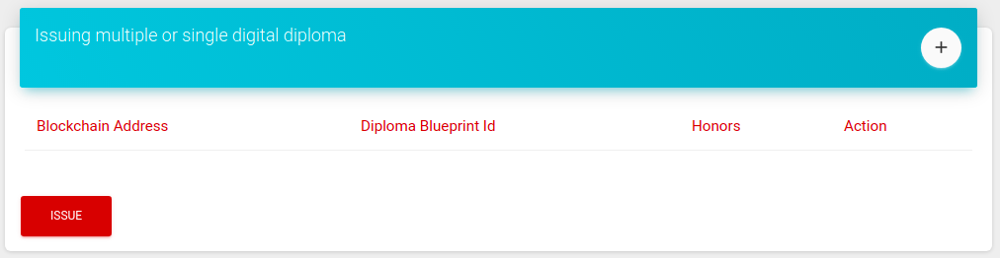

To add a diploma draft , we click on: 

#### 2. Fill in the add diploma holder form

After clicking on the add button, a diploma form will pop up. The admin selects the diploma's holder, choose the diploma's blueprint and provides the extra inputs.

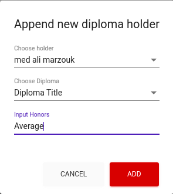

#### 3. Validate the diploma issuing

After filling the diploma form, a new diploma draft is appended to the diploma drafts list.

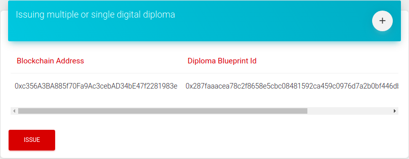

We can reduce the diplomas draft list by removing elements (by clicking on the trash button).

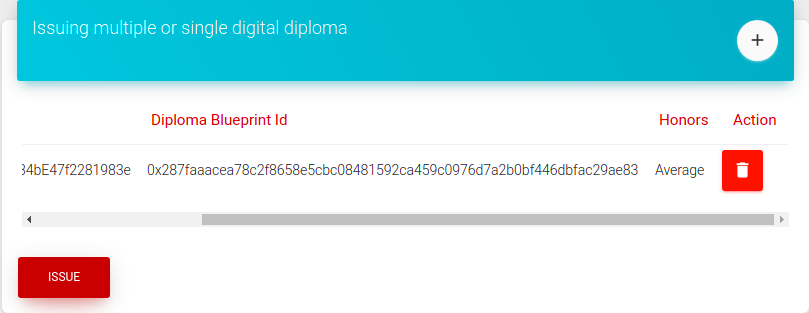

After verifying the diplomas values, the admin inititates the issuing process through the issue button.

For each seperate diploma creation, the admin is required to confirm the ethereum transaction through the pop-up metamask window

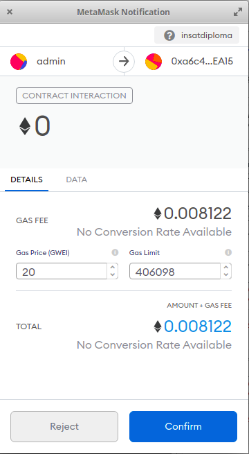

After validating the transaction, the diploma will be created and added to the holder diplomas list.

### Examine digital diploma requests

Validating diploma is the solely admin responsability. After verifying the diploma demands with the institute's administration, the platform's admin can validate the creation. 

#### 1. Navigate to the diploma requests

In the admin's dashboard, navigate to the requests component, which will contain all the requested diplomas with their provided details.

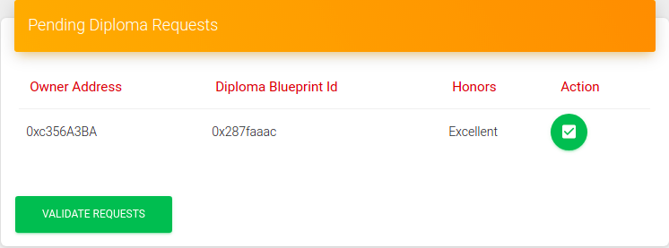

#### 2. Select the requests to validate

By clicking on the green rounded button next to request's details, the admin adds the corresponding diploma to be validated.

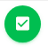

Otherwise, the admin clicks on the red button to refuse a request.

#### 3. Validate the selected requests

After selecting the requests to be validated, the admin  initiates the validation phase by clicking on the validate button.

For each validation request, the admin confirms the corresponding ethereum transaction. After that, a new diploma will be added to the holder's diplomas list.

## Student Role 

The student is the main client of the diplomachain platform. In fact, he is not only able to download the already issued diplomas but also to request a diploma from the platform's admin.

### Request a digital diploma

A student requests a diploma which will be added to his diplomas list after being validated by the admin.

#### 1. Navigate to the student dashboard

Navigate to the diplomas list in the student's dashboard.

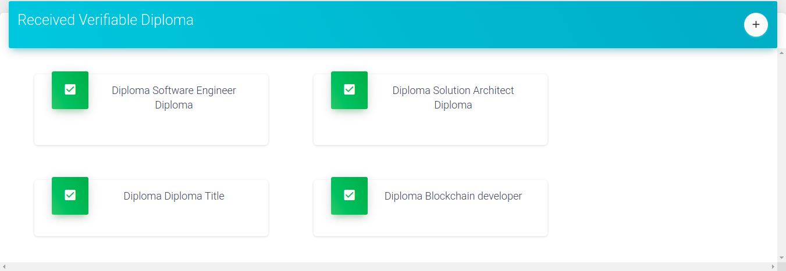

Focusing on the component's header. 

To request a diploma, a student can click on the add button:

#### 2. Fill in the diploma request form

After clicking on the add button, the student can fill up the form by selecting the desired diploma and providing other diploma values.

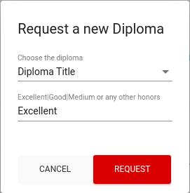

To execute the request transaction, the student must click on the request button:

After requesting the diploma, the student confirms the ethereum transaction.

#### 3. Check the diplomas list

After requesting the diploma, the student can check his diplomas list to find his requested diploma in pending state.

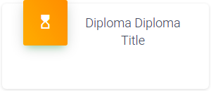

### Download a digital diploma in file format

In the aim of sharing a received digital diploma, a student is able to download it easily.

#### 1. Navigate to the student's dashboard

A student navigates to the diplomas list.

#### 2. Select the needed diploma

Click on the chosen diploma.

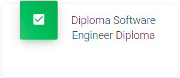

A diploma modal will pop-up which contains the diploma details within a visual representation:

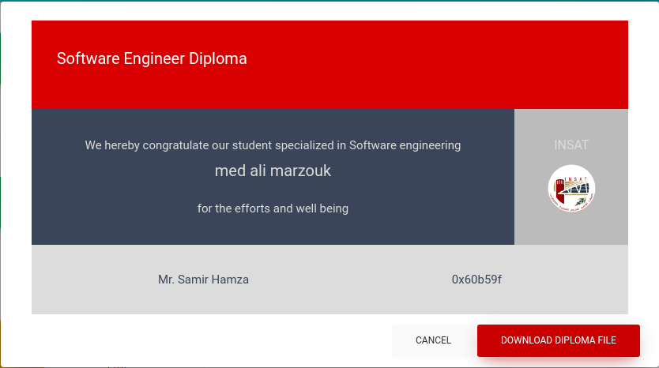

#### 3. Download the diploma file

Click on the download button.

Initiate the download of the diploma file.

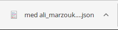

Any modification in the downloaded file will result in a corrupted diploma that will be invalid in the verification process.

## Verifier Role 

The verifier role is assigned for each visitor of the Diplomachain platform, verifying a diploma doesn't require an Ethereum address.

### Verify digital diploma

#### 1. Navigate to the verification page
 
Visit the verification page which contains various animation elements to visualize the progress of the verification process on one side and also contains the form used to upload the diploma's file on the other side.

#### 2. Upload the file

To upload a diploma's file, the user can either use the upload file input or drag and drop the diploma file.

- Uploading file

Clicking on the upload file button will open the popup to select the file from the user's machine storage.

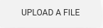

The file's format must be JSON (JavaScript Object Notation).

- Drag & drop

Otherwise, we can drag & drop the file, dragging the selected file to the verification box will trigger the application to upload the file. 

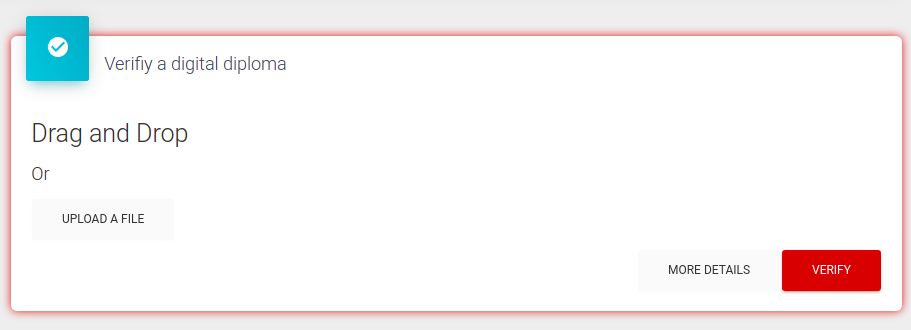

#### 3. Validate

After uploading the file, the view of the form changes to include the file name.

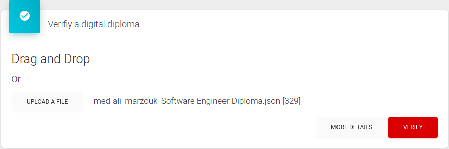

Now, the user can initiate the verification process, by clicking on the verify button.

Depending on the provided diploma, the user is informed shortly whether the diploma is valid or not through the progress indicator elements:

For a valid diploma, all the indicators get filled with a green color.

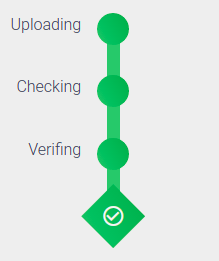

Otherwise, the last verification step will be filled with a red color.

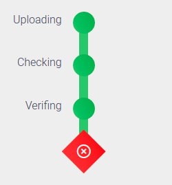

If any problem occurs during the process, the corresponding indicator will be also filled with a red color.

## Conclusion 

### In this document, we went through the different roles in the diplomachain platform and then we introduced the features and presented the steps required for each one. Every step contained a small description and few screenshots to facilitate the user's understanding.
